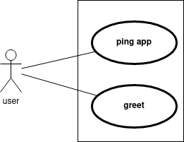

# Simple example

Suppose we have this application with these two use cases

## Implementations
### Ping app use case logic
~~~python
def __implementation__(self, *args, **kwargs): 
    return {"ping": "ok"}
~~~

### Greet use case logic

~~~python
def __implementation__(self, name, *args, **kwargs):
    return {"message": f"Hi! {name}, how are u?"}
~~~

Now, you can use these use cases in the technology of your choice

## Technologies

### Pure python

~~~python
from examples.greetAndPing.GreetUseCase import greet

if __name__ == '__main__':
    print(greet(input("What is your name?\n")))
~~~

As we can do this, we can also test the use case and manipulate it as we wish.

### Flask example

~~~python
from examples.greetAndPing.frameworks.flaskimp import Flask
from markupsafe import escape
# Local
from examples.greetAndPing.GreetUseCase import greet
from examples.greetAndPing.PingAppUseCase import pingApp

app = Flask(__name__)

@app.route("/greet/<name>")
def greet_route(name): return greet(name=escape(name))

@app.route("/ping")
def ping_route(): return pingApp()
~~~

The only thing left to do is to choose an optimal way to abort for flask or to create it